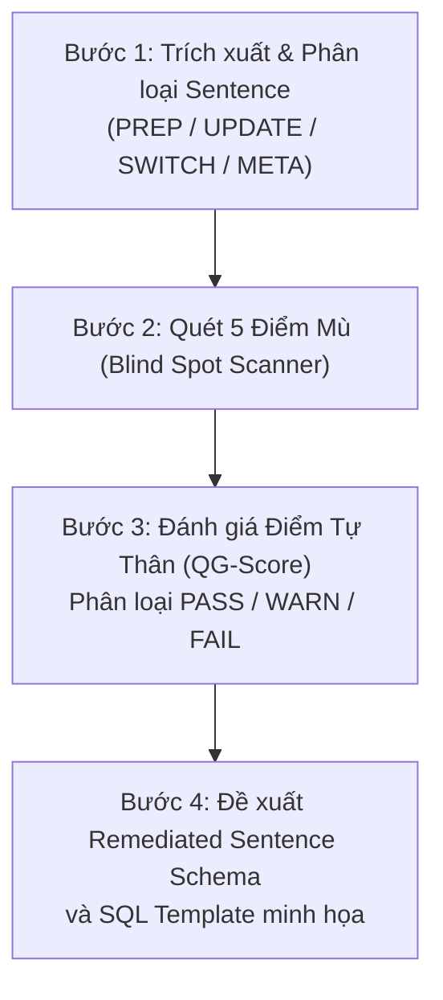

# Sentence Quality Gate Skill — MetadataCompiler Pipeline
> Domain: Japanese Property Management · Target: Self-Contained Sentence Specification for SQL/VBA Generation  
> Stack: MS Access VBA / Jet SQL / Python Scanner DSL / LLM-Driven Compiler

---

## PHẦN I — TRIẾT LÝ & ĐỊNH NGHĨA QUALITY GATE

### 1.1 Khái Niệm "Self-Contained Sentence" Là Gì?
Trong hệ sinh thái **MetadataCompiler**, một **Sentence** là **đơn vị nguyên tử (Atomic Semantic Unit)** chứa toàn bộ thông tin cần thiết để biểu diễn một thao tác cơ sở dữ liệu (`UPDATE`, `INSERT`, `ALTER TABLE`, hoặc đánh dấu cờ `FLG`).

Một Sentence được xem là **ĐẠT CHUẨN TỰ THÂN (Self-Contained)** khi và chỉ khi:
> **Một Agent hoặc LLM độc lập chỉ cần đọc duy nhất nội dung của Sentence đó là có thể viết ra câu lệnh SQL / VBA tương ứng chính xác 100%, mà không phải đoán mò (Zero-Assumption), không phải tra cứu chéo sang file Excel gốc, và không cần suy diễn các trường bị thiếu.**

### 1.2 Vai Trò Của Quality Gate Trong Pipeline
```
[Excel Spec JP] 
      │
      ▼ (xlsx_scanner.py)
[sheet_raw.json] 
      │
      ▼
┌────────────────────────────────────────────────────────┐
│        ★ SENTENCE QUALITY GATE (Skill Này) ★           │
│  - Kiểm định 5 tiêu chí vàng (QG-1 đến QG-5)           │
│  - Phát hiện & cảnh báo điểm mù ngữ cảnh               │
│  - Chuẩn hóa cấu trúc cây quyết định (Decision Tree)   │
│  - Bổ sung định danh bảng & khóa nối tường minh        │
└────────────────────────────────────────────────────────┘
      │
      ▼ (100% PASS)
[vba_compiler.py / LLM SQL Generator] 
      │
      ▼
[Production Access VBA Code (SQL = "" ... db.Execute SQL)]
```

---

## PHẦN II — BỘ 5 TIÊU CHÍ VÀNG (THE 5 GOLDEN CRITERIA)

Mỗi sentence khi thẩm định bắt buộc phải được đối soát qua 5 tiêu chí sau:

### Tiêu Chí QG-1: Target Resolution (Định danh đích rõ ràng)
- **Yêu cầu**: Phải xác định rõ bảng đích (`target_table` / buffer) và trường đích (`target_field` / `項目名`).
- **Phân loại thao tác**:
  - `PREP_ADD_COL`: Thao tác thêm cột đệm vào bảng nguồn/bảng phụ trước khi xử lý (ví dụ: tạo `判別キー`).
  - `MAIN_UPDATE`: Cập nhật giá trị vào một cột cụ thể của bảng đích `target_table`.
  - `FILTER_FLAG`: Đánh dấu loại trừ bản ghi (`FLG = '1'`).
  - `EXPORT_META`: Thông tin cấu hình xuất tệp (không sinh SQL `UPDATE/INSERT`).
- **Vi phạm (FAIL)**: Sentence thiếu `項目名` trong khi đang thực hiện logic gán giá trị hoặc ghép chuỗi.

### Tiêu Chí QG-2: Source Traceability (Truy xuất nguồn gốc 100%)
- **Yêu cầu**: Mọi trường tham chiếu trong biểu thức hoặc mệnh đề điều kiện PHẢI được gắn liền với bảng/tệp nguồn xác định (`該当ファイル名` hoặc thuộc `target_table`).
- **Giải mã bí danh (Alias Resolution)**: Nếu spec Excel dùng tên cột viết tắt (như `TEL1(契)` thay vì `TEL1（契約者）`), sentence phải tự động ánh xạ về đúng tên cột chính thức trong CSDL đích.
- **Vi phạm (FAIL)**: Tồn tại trường có `該当ファイル名 = None` hoặc để tên cột lơ lửng không rõ thuộc bảng nào.

### Tiêu Chí QG-3: Explicit JOIN Mechanics (Khóa nối bảng tường minh)
- **Yêu cầu**: Mọi quan hệ nối bảng phải xác định rõ ràng cặp khóa liên kết 2 vế:
  $$\text{Target\_Table}.[\text{JoinKeyLeft}] = \text{Source\_Table}.[\text{JoinKeyRight}]$$
- **Tái sử dụng khóa nối**: Nếu ở bước trước đã sinh một khóa tổng hợp (ví dụ `契約ID` ở Case 2), các bước sau cần nối bảng bằng khóa này phải kế thừa trực tiếp, không được mô tả lại công thức chắp vá.
- **Vi phạm (FAIL)**: Dòng `処理 = "紐づけ"` rỗng (`None = None`), hoặc chỉ ghi tên 1 bảng mà không có khóa nối.

### Tiêu Chí QG-4: Deterministic Transformation (Biểu thức tất định)
- **Yêu cầu**: Công thức biến đổi phải rõ ràng toán tử tương thích với Access Jet SQL & VBA:
  - Cắt chuỗi: `Left(...)`, `Mid(...)`, `Right(...)`.
  - Nối chuỗi: `& '-' &`.
  - Format: `Format(..., 'yyyy-mm-dd')`.
  - Thay thế / Xóa ký tự: `Replace(...)`, `Val(...)`.
- **Vi phạm (FAIL)**: Điều kiện văn xuôi tiếng Nhật chưa được phân tích thành biểu thức máy hiểu được (ví dụ: `"DXRより前を削除"` chưa có hàm cắt chuỗi).

### Tiêu Chí QG-5: Scoped & Structured Branching (Phạm vi phân nhánh có cấu trúc)
- **Yêu cầu**:
  - Mọi điều kiện so sánh trong hàm `SWITCH` hoặc `WHERE` phải có đầy đủ định danh bảng (ví dụ: `T.[契約者コード] = T.[入居者コード]` thay vì `契約者コード = 入居者コード`).
  - Các case có cấu trúc phân nhánh nhiều tầng (Decision Tree) **KHÔNG ĐƯỢC ÉP PHẲNG (Flatten)** thành một mảng 30 dòng hỗn độn, mà phải tổ chức thành cấu trúc cây có phân cấp Nhánh lớn (`branch`) và Quy tắc con (`sub_rules`).
- **Vi phạm (FAIL)**: Mảng phẳng lẫn lộn nhiều tầng điều kiện, hoặc có điều kiện cụt dạng `"値がある場合"` mà không biết của trường nào.

---

## PHẦN III — QUY TRÌNH AUDIT SENTENCE THỰC HÀNH (4 BƯỚC)

Khi được yêu cầu kiểm định một file `sheet_raw.json` hoặc một case cụ thể, Agent áp dụng quy trình sau:



### Bước 1: Trích xuất & Phân loại
Xác định loại hình của sentence:
1. `PREP`: Tiền xử lý tạo cột mới trên bảng nguồn (`ALTER TABLE ... ADD COLUMN`).
2. `INHERITED_JOIN`: Sentence cập nhật 1 trường đơn lẻ có kế thừa ngữ cảnh JOIN.
3. `DECISION_TREE_SWITCH`: Sentence gán giá trị dựa trên cây điều kiện phân nhánh phức tạp.
4. `META_ONLY`: Sentence mang tính mô tả cấu hình file xuất.

### Bước 2: Quét 5 Điểm Mù Ngữ Cảnh (Blind Spots)
Kiểm tra các bẫy phổ biến trong dữ liệu quét từ Excel:
- [ ] **Điểm mù 1**: Dòng `紐づけ` rỗng không có file và cột?
- [ ] **Điểm mù 2**: Tên cột bị viết tắt theo Excel thô chưa map sang CSDL?
- [ ] **Điểm mù 3**: Tham chiếu sai file nguồn (ví dụ cột `契約形態` bị gán nhầm vào file không chứa nó)?
- [ ] **Điểm mù 4**: Dòng rác/ghi chú trung gian lọt vào mảng rows (ví dụ dòng gán nhầm mã hợp đồng vào trường số điện thoại)?
- [ ] **Điểm mù 5**: Mất định danh bảng sở hữu trong các vế điều kiện so sánh?

### Bước 3: Đánh Giá & Gán Nhãn Trạng Thái
- **PASS**: Đạt 5/5 tiêu chí, sẵn sàng chuyển cho LLM / Compiler sinh SQL ngay lập tức.
- **WARN**: Đủ thông tin cơ bản nhưng còn thiếu định danh bảng đích tường minh (cần Agent ngầm định).
- **FAIL**: Thiếu khóa nối, mất nguồn trường, hoặc cấu trúc điều kiện bị vỡ khiến việc sinh SQL chắc chắn gặp lỗi runtime.

### Bước 4: Chuẩn Hóa Sang "Remediated Sentence Contract Schema"
Cung cấp định dạng JSON chuẩn đã được làm giàu ngữ cảnh (xem Phần IV).

---

## PHẦN IV — CATALOGUE CÁC MẪU SENTENCE CHUẨN MỰC (CONTRACT SCHEMAS)

### Mẫu 1: Prep Sentence (Tạo Cột Phụ / Cột Ghép Mã)
```json
{
  "sentence_id": "SP_CASE_01_S01",
  "category": "PREP_ADD_COL",
  "target_table": "契約者情報テキスト",
  "new_column": "判別キー",
  "column_type": "TEXT(255)",
  "expression": "Left(T.[物件コード], Len(T.[物件コード]) - 2) & T.[契約者名]",
  "purpose": "Tạo khóa nối trung gian trên bảng nguồn"
}
```
*SQL tương ứng:*
```sql
ALTER TABLE [契約者情報テキスト] ADD COLUMN [判別キー] TEXT(255);
UPDATE [契約者情報テキスト] AS T SET T.[判別キー] = Left(T.[物件コード], Len(T.[物件コード]) - 2) & T.[契約者名];
```

---

### Mẫu 2: Context Inherited JOIN Update (Nối Bảng Cập Nhật 1 Trường)
```json
{
  "sentence_id": "SP_CASE_03_S01",
  "category": "JOIN_UPDATE",
  "target_table": "target_table",
  "target_field": "TEL1（契約者）",
  "join": {
    "source_table": "電話番号",
    "left_key": "T.[判別キー]",
    "right_key": "T1.[判別キー]"
  },
  "value_expression": "T1.[TEL1(契)]",
  "condition": null
}
```
*SQL tương ứng:*
```sql
UPDATE target_table AS T 
INNER JOIN [電話番号] AS T1 ON T.[判別キー] = T1.[判別キー] 
SET T.[TEL1（契約者）] = T1.[TEL1(契)];
```

---

### Mẫu 3: Structured Decision Tree SWITCH (Cây Điều Kiện Phân Nhánh)
```json
{
  "sentence_id": "SP_CASE_04_S01",
  "category": "DECISION_TREE_SWITCH",
  "target_table": "target_table",
  "target_field": "優先架電先",
  "decision_tree": [
    {
      "branch_name": "入居者＝契約者の場合",
      "main_condition": "T.[契約者コード] = T.[入居者コード]",
      "priority_rules": [
        {"when": "T.[TEL1（契約者）] IS NOT NULL", "then": "T.[TEL1（契約者）]"},
        {"when": "T.[携帯（契約者）] IS NOT NULL", "then": "T.[携帯（契約者）]"},
        {"when": "T.[TEL1（入居者）] IS NOT NULL", "then": "T.[TEL1（入居者）]"},
        {"when": "T.[携帯（入居者）] IS NOT NULL", "then": "T.[携帯（入居者）]"}
      ]
    },
    {
      "branch_name": "入居者≠契約者 且つ 法人",
      "main_condition": "T.[契約者コード] <> T.[入居者コード] AND T.[法人個人区分] = '法人'",
      "priority_rules": [
        {"when": "T.[TEL1（入居者）] IS NOT NULL", "then": "T.[TEL1（入居者）]"},
        {"when": "T.[携帯（入居者）] IS NOT NULL", "then": "T.[携帯（入居者）]"}
      ]
    },
    {
      "branch_name": "入居者≠契約者 且つ 個人",
      "main_condition": "T.[契約者コード] <> T.[入居者コード] AND T.[法人個人区分] = '個人'",
      "priority_rules": [
        {"when": "T.[TEL1（契約者）] IS NOT NULL", "then": "T.[TEL1（契約者）]"},
        {"when": "T.[携帯（契約者）] IS NOT NULL", "then": "T.[携帯（契約者）]"},
        {"when": "T.[TEL1（入居者）] IS NOT NULL", "then": "T.[TEL1（入居者）]"},
        {"when": "T.[携帯（入居者）] IS NOT NULL", "then": "T.[携帯（入居者）]"}
      ]
    }
  ],
  "default_value": "NULL"
}
```
*SQL tương ứng:*
```sql
UPDATE target_table AS T 
SET T.[優先架電先] = SWITCH(
    T.[契約者コード] = T.[入居者コード] AND T.[TEL1（契約者）] IS NOT NULL, T.[TEL1（契約者）],
    T.[契約者コード] = T.[入居者コード] AND T.[携帯（契約者）] IS NOT NULL, T.[携帯（契約者）],
    T.[契約者コード] = T.[入居者コード] AND T.[TEL1（入居者）] IS NOT NULL, T.[TEL1（入居者）],
    T.[契約者コード] = T.[入居者コード] AND T.[携帯（入居者）] IS NOT NULL, T.[携帯（入居者）],
    T.[契約者コード] <> T.[入居者コード] AND T.[法人個人区分] = '法人' AND T.[TEL1（入居者）] IS NOT NULL, T.[TEL1（入居者）],
    T.[契約者コード] <> T.[入居者コード] AND T.[法人個人区分] = '法人' AND T.[携帯（入居者）] IS NOT NULL, T.[携帯（入居者）],
    T.[契約者コード] <> T.[入居者コード] AND T.[法人個人区分] = '個人' AND T.[TEL1（契約者）] IS NOT NULL, T.[TEL1（契約者）],
    T.[契約者コード] <> T.[入居者コード] AND T.[法人個人区分] = '個人' AND T.[携帯（契約者）] IS NOT NULL, T.[携帯（契約者）],
    T.[契約者コード] <> T.[入居者コード] AND T.[法人個人区分] = '個人' AND T.[TEL1（入居者）] IS NOT NULL, T.[TEL1（入居者）],
    T.[契約者コード] <> T.[入居者コード] AND T.[法人個人区分] = '個人' AND T.[携帯（入居者）] IS NOT NULL, T.[携帯（入居者）],
    True, NULL
);
```

---

## PHẦN V — CHECKLIST NGHIỆM THU TRƯỚC KHI BÀN GIAO SANG COMPILER

Trước khi phê duyệt một `sheet_raw.json` để chuyển sang bước sinh code VBA:
- [ ] 1. Toàn bộ các sentence trong `特殊処理` đều có `category` rõ ràng.
- [ ] 2. Không còn bất kỳ dòng `紐づけ` nào bị `None = None` hoặc rỗng khóa.
- [ ] 3. 100% các bí danh cột (`TEL1(契)`, v.v.) được quy đổi thành tên cột chính thức trong CSDL.
- [ ] 4. Các điều kiện `SWITCH` được bóc tách theo thứ bậc cha-con (`main_condition` + `priority_rules`).
- [ ] 5. Các dòng thông tin định danh file xuất được gắn nhãn `EXPORT_META` để không bị sinh câu lệnh SQL vô nghĩa.
