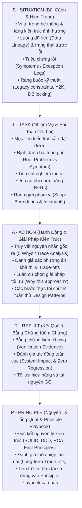

# STAR-P Solution Architecture Problem-Solving & Analysis Skill

## 1. Tổng Quan & Vai Trò (Singleton Responsibility)
Skill này đóng vai trò duy nhất (**Single Responsibility**): **Chuẩn hóa khung tư duy phân tích sự cố (Root Cause Analysis), thiết kế giải pháp kỹ thuật và báo cáo kiến trúc theo 5 trụ cột nguyên lý STAR-P (Situation - Task - Action - Result - Principle)**.

Mục tiêu tối thượng của Skill là chuyển giao năng lực tư duy từ Hội đồng Solution Architecture sang người dùng, giúp người dùng hiểu rõ bản chất vấn đề ở tầm kiến trúc, nắm bắt các ràng buộc, đánh giá thỏa hiệp (Trade-offs), tự mình ra quyết định kỹ thuật độc lập và xây dựng **Principle Playbook** cá nhân tích lũy theo thời gian.

---

## 2. Khung Tư Duy 5 Trụ Cột STAR-P Dành Riêng Cho Solution Architect

Mỗi khi phân tích một lỗi (Bug / Incident), thiết kế tính năng mới (Architecture Feature), tái cấu trúc (Refactoring), hoặc tối ưu hóa (Optimization), báo cáo **BẮT BUỘC** phải tuân thủ 5 phần sau:




---

## 3. Chi Tiết Thực Thi Từng Trụ Cột

### 🔍 S - SITUATION: Bối Cảnh & Hiện Trạng Kiến Trúc
*Mục đích: Định vị không gian bài toán trong bức tranh tổng thể của hệ thống, không nhìn phiến diện ở một dòng code.*
1. **Phân tầng kiến trúc liên quan**: Sự cố hoặc yêu cầu nằm ở đâu?
   - `Controller` (Tương tác UI, Session, Validation form, postSwitch)
   - `Service` (Business logic, Điều phối giao dịch, Master enrichment)
   - `Repository / DB` (Câu lệnh SQL `@Query`, Table Function, Index, Locking, Native queries)
   - `Batch Coordinator / JCL` (Phối hợp chuỗi Step, work file `TD`/`TS`, bảng đệm `loop_back`)
   - `Common Utility` (`LSS1000`, `LSS1010`, Formatters)
2. **Luồng dữ liệu (Data Flow & Lineage)**:
   - Dữ liệu đi từ đâu đến đâu? (Client $\rightarrow$ Form $\rightarrow$ Controller $\rightarrow$ Service $\rightarrow$ Table Function / Master DB $\rightarrow$ Response Form $\rightarrow$ UI List/Grid).
3. **Triệu chứng & Minh chứng thực tế**:
   - Triệu chứng bề mặt: Mã lỗi, Exception class, stack trace, dữ liệu bị sai lệch, màn hình treo, v.v.
4. **Các ràng buộc hệ thống hiện hữu**:
   - Ràng buộc tương thích ngược (Backward Compatibility), quy tắc thế kỷ Y2K, quy chuẩn Comment của dự án, cấu trúc DB legacy.

---

### 🎯 T - TASK: Nhiệm Vụ & Bài Toán Cốt Lõi Cần Giải Quyết
*Mục đích: Xác định chính xác bài toán gốc rễ cần giải quyết, tránh "chữa triệu chứng mà để sót nguyên nhân".*
1. **Mục tiêu kiến trúc (Architectural Goal)**:
   - Hệ thống cần đạt trạng thái mong muốn nào sau khi xử lý?
2. **Phân tách Triệu chứng vs Bài toán Cốt lõi**:
   - ❌ *Triệu chứng (Symptom)*: "Màn hình bị NullPointerException khi bấm F1."
   - ✅ *Bài toán cốt lõi (Root Problem)*: "Service trả về danh sách rỗng khiến Controller truy cập `list.get(0)` mà thiếu bước kiểm tra tập hợp theo quy tắc Defensive Programming."
3. **Tiêu chí nghiệm thu & Yêu cầu phi chức năng (NFRs)**:
   - Tính toàn vẹn dữ liệu (Data Integrity).
   - Hiệu năng & áp lực thu gom rác (GC Pressure / Memory Footprint).
   - Tính dễ bảo trì (Maintainability & Clean Architecture).
4. **Ranh giới phạm vi (Scope & Architectural Boundaries)**:
   - Những thành phần được phép thay đổi.
   - Những nguyên tắc bất biến KHÔNG ĐƯỢC xâm phạm (như Plan Immutability, Gold Standard Structure).

---

### 🛠️ A - ACTION: Hành Động & Phương Án Xử Lý Chuẩn Kiến Trúc
*Mục đích: Đưa ra quyết định kỹ thuật có cơ sở khoa học, đánh giá đa chiều các giải pháp thay vì chọn giải pháp đầu tiên nghĩ ra.*
1. **Phân tích nguyên nhân gốc rễ (Root Cause Analysis)**:
   - Áp dụng phương pháp **5 Whys** để đào sâu từ hiện tượng đến bản chất thiết kế.
   - Dẫn chứng vị trí code cụ thể (File path, line number, SQL clause).
2. **Đánh giá các phương án (Options Assessment & Trade-offs)**:
   - Lập bảng so sánh tối thiểu 2 phương án:
     | Tiêu Chí Đánh Giá | Phương Án A (Đề Xuất Tối Ưu) | Phương Án B (Phương Án Thay Thế / Fallback) |
     |---|---|---|
     | **Tính đúng đắn kiến trúc** | Tuân thủ Clean Architecture / Single Responsibility | Chữa nhanh triệu chứng (Quick fix) |
     | **Rủi ro hồi quy (Regression)** | Thấp, cô lập trong module | Cao, ảnh hưởng đến các tầng phụ thuộc |
     | **Tác động hiệu năng / GC** | Tối ưu, tái sử dụng bộ nhớ | Tăng chi phí cấp phát đối tượng |
     | **Độ phức tạp bảo trì** | Thấp, code tường minh, có comment cây chuẩn | Khó bảo trì, che giấu lỗi ngầm |
3. **Luận cứ lựa chọn giải pháp tối ưu**:
   - Giải thích rõ vì sao Phương Án A là lựa chọn tốt nhất dựa trên nguyên lý kỹ thuật phần mềm.
4. **Kế hoạch thực thi chi tiết (Step-by-Step Implementation)**:
   - Các bước sửa đổi mã nguồn cụ thể, áp dụng đúng Design Pattern và chuẩn mực dự án.

---

### 📊 R - RESULT: Kết Quả & Bằng Chứng Kiểm Chứng
*Mục đích: Kiểm chứng giải pháp, đảm bảo không có tác dụng phụ, tính tương thích ngược và tối ưu tài nguyên.*
1. **Kết quả đạt được**:
   - Trạng thái hệ thống sau khi giải quyết.
2. **Bằng chứng xác thực (Verification Evidence)**:
   - Kết quả chạy test, kiểm tra biên dịch, log trace xác nhận, hoặc checklist tự rà soát.
3. **Đánh giá tác động toàn cục (System Impact Assessment)**:
   - Khẳng định tính tương thích ngược, không gây hồi quy (Zero Regression).
   - Tác động tích cực đến hiệu năng (giảm GC Pressure, tối ưu thời gian phản hồi).

---

### 💡 P - PRINCIPLE: Nguyên Lý Tổng Quát & Principle Playbook
*Mục đích: Biến kinh nghiệm của từng case xử lý thành tài sản tri thức tái sử dụng bền vững.*
1. **Đúc kết nguyên lý kiến trúc cốt lõi**:
   - Rút ra 1 đến 3 nguyên lý tổng quát (Ví dụ: *Nguyên lý Fail-Fast, Single Source of Truth trong Validation, Kỹ thuật Loop Variable Hoisting để giảm GC Overhead, Quy tắc Bất Biến của Migration Plan*).
2. **Tích lũy vào Principle Playbook cá nhân**:
   - Phân loại và ghi nhận bài học theo **nguyên lý cốt lõi** (thay vì ghi chép theo tên dự án) để áp dụng xuyên suốt cho các hệ thống khác trong tương lai.

---

## 4. Mẫu Báo Cáo Chuẩn (Standard STAR-P Analysis Template)

```markdown
### 1. 🔍 SITUATION (Bối Cảnh & Hiện Trạng)
- **Tầng Kiến Trúc Bị Ảnh Hưởng**: [Controller / Service / Repository / Batch / Utility]
- **Luồng Dữ Liệu**: [Mô tả luồng từ Input -> Process -> Output]
- **Triệu Chứng / Hiện Tượng**: [Chi tiết lỗi, Exception, Log trace]
- **Ràng Buộc Hệ Thống**: [Các ràng buộc kỹ thuật hoặc quy chuẩn liên quan]

### 2. 🎯 TASK (Nhiệm Vụ & Bài Toán Cốt Lõi)
- **Mục Tiêu Kiến Trúc**: [Mục tiêu cần đạt]
- **Phân Tích Bài Toán Gốc (Root Problem)**: [Bản chất bài toán vs Triệu chứng bề mặt]
- **Yêu Cầu Phi Chức Năng (NFRs)**: [Performance, GC, Maintainability, Security]
- **Ranh Giới Can Thiệp**: [Phạm vi được phép sửa]

### 3. 🛠️ ACTION (Hành Động & Giải Pháp Kiến Trúc)
- **Truy Vết Nguyên Nhân Gốc (Root Cause Analysis)**: [5 Whys / Dẫn chứng code]
- **Đánh Giá Phương Án & Thỏa Hiệp (Trade-offs)**: [So sánh Phương Án A vs B]
- **Luận Cứ Chọn Giải Pháp**: [Lý do chọn phương án tối ưu]
- **Các Bước Triển Khai Chi Tiết**: [Step 1, Step 2, Step 3...]

### 4. 📊 RESULT (Kết Quả & Bằng Chứng Xác Thực)
- **Kết Quả Đạt Được**: [Outcome]
- **Bằng Chứng Xác Thực**: [Verification evidence]
- **Đánh Giá Tác Động Toàn Cục**: [Zero regression, Performance impact]

### 5. 💡 PRINCIPLE (Nguyên Lý Tổng Quát & Principle Playbook)
- **Nguyên Lý Kiến Trúc Cốt Lõi**: [SOLID, Clean Code, Fail-Fast, GC Hoisting, v.v.]
- **Principle Playbook Entry**: [Đúc kết tư duy nhận diện và tự giải quyết trong tương lai]
```
