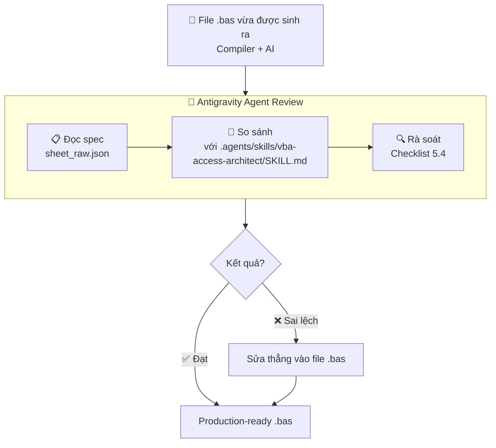
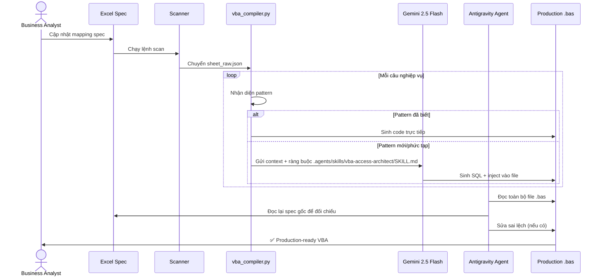

# 🏗️ Metadata Compiler V1 — Thuyết Trình Kiến Trúc Hệ Thống

> **Đối tượng:** Hội đồng Solution Architecture, Technical Leads & Stakeholders
> **Mục tiêu:** Mô tả rõ ràng quy trình 3 tầng — từ dữ liệu nguồn đến Production VBA, không cần kiến thức kỹ thuật chuyên sâu.

---

## Slide 1 — Vấn Đề & Giải Pháp

### Bài Toán Đặt Ra

Trong dự án quản lý bất động sản quy mô lớn, hệ thống cần định kỳ **đồng bộ dữ liệu từ hàng chục file CSV nguồn** (thông tin hợp đồng, thông tin nhà ở, danh sách khách hàng...) sang một cơ sở dữ liệu Access trung tâm thông qua các đoạn code VBA.

Trước đây, mỗi lần spec thay đổi, lập trình viên phải:
1. Đọc tay file Excel mapping phức tạp viết bằng tiếng Nhật
2. Viết lại toàn bộ VBA theo logic nghiệp vụ tương ứng
3. Kiểm tra thủ công từng câu SQL cho đến khi đúng

**→ Tốn kém, dễ sai, khó mở rộng.**

### Giải Pháp: Quy Trình 3 Tầng Tự Động

Metadata Compiler V1 thay thế toàn bộ quy trình thủ công bằng một pipeline thông minh gồm **3 tác nhân phối hợp liên tiếp**, mỗi tác nhân đảm nhiệm một vai trò riêng biệt.

---

## Slide 2 — Tổng Quan Pipeline 3 Tầng


| Tầng | Tác nhân | Vai trò |
|------|----------|---------|
| 🔵 **Tầng 1** | `vba_compiler.py` | Đọc dữ liệu spec, sinh code tự động cho các pattern đã biết |
| 🟣 **Tầng 2** | Gemini 2.5 Flash | Xử lý các trường hợp chưa có pattern, sinh SQL thông minh |
| 🟡 **Tầng 3** | Antigravity Agent | Rà soát toàn bộ output so với .agents/skills/vba-access-architect/SKILL.md và spec gốc |

---

## Slide 3 — Tầng 1: Compiler Engine sinh code từ dữ liệu


### `vba_compiler.py` làm gì?

**Đầu vào:** File `sheet_raw.json` — bản đặc tả nghiệp vụ đã được chuẩn hóa từ Excel

**Quy trình xử lý:**

```
1. Đọc từng "sentence" (câu nghiệp vụ) trong spec
        ↓
2. Nhận diện loại xử lý:
   ┌─ Lọc bản ghi (JOIN Filter, Blank Check...)
   ├─ Chèn dữ liệu thẳng (INSERT INTO)
   └─ Cập nhật đặc biệt (SWITCH, Dim con...)
        ↓
3. Sinh đoạn VBA/SQL tương ứng theo template chuẩn
        ↓
4. Gộp thành file .bas hoàn chỉnh
```

**Đầu ra:** File `.bas` với đầy đủ boilerplate (kết nối DB, Timer, log, cleanup)

### Điều Compiler đảm bảo tự động

- Mỗi module đều có đúng cấu trúc: **Lọc → Chèn → Override**
- Cột `FLG` được thêm vào đầu và xóa đi ở cuối
- Giá trị dấu gạch ngang `"-"` được chuẩn hóa thành `NULL` tự động
- Prefix `X_`, `S_`, `C_`... được gán đúng theo từng loại dữ liệu

---

## Slide 4 — Tầng 2: Gemini 2.5 Flash xử lý ngoại lệ

### Khi nào Compiler chuyển sang AI?

Compiler chỉ xử lý được những pattern **đã được định nghĩa sẵn** trong từ điển nghiệp vụ (`semantic_dictionary.json`). Khi gặp một câu nghiệp vụ phức tạp hoặc chưa từng xuất hiện, thay vì bỏ trống hoặc báo lỗi, hệ thống chuyển ngay sang Gemini 2.5 Flash.

### Gemini nhận được gì?

Gemini không chỉ nhận câu hỏi đơn thuần. Hệ thống truyền vào:
- **Ngữ cảnh nghiệp vụ** của sheet đang xử lý
- **Đoạn JSON spec** của câu nghiệp vụ cần sinh code
- **Các ràng buộc kiến trúc** từ `.agents/skills/vba-access-architect/SKILL.md` để AI tạo ra code đúng chuẩn ngay từ đầu

### Gemini trả về gì?

Một đoạn SQL/VBA hoàn chỉnh được nhúng trực tiếp vào vị trí tương ứng trong file `.bas`, liền mạch với phần còn lại do Compiler tạo ra.

### Khi AI gặp sự cố?

Nếu API gặp lỗi (hết quota, timeout), hệ thống **không bao giờ crash**. Thay vào đó, vị trí đó sẽ được đánh dấu bằng một comment `TODO:AI_REVIEW` kèm toàn bộ JSON context gốc — developer chỉ cần xử lý đúng phần còn thiếu đó, không phải làm lại toàn bộ file.

---

## Slide 5 — Tầng 3: Antigravity Agent kiểm tra chất lượng



### Antigravity Agent làm gì cụ thể?

Đây là bước **quality gate** cuối cùng trước khi file được chấp nhận. Agent không chỉ đọc code mà thực sự **đọc spec gốc** từ `sheet_raw.json` và **đối chiếu từng phần** với output:

| Hạng mục kiểm tra | Nội dung |
|---|---|
| **Đúng nghiệp vụ** | Các bảng JOIN, điều kiện lọc có khớp với spec không? |
| **Đúng kiến trúc** | FLG cascading đúng tầng, SWITCH pattern đúng chuẩn? |
| **Đúng chuẩn SQL** | Không có syntax lỗi, NULL handling đầy đủ? |
| **Đúng boilerplate** | Timer, log_write, chk_required có mặt đầy đủ? |
| **Tối ưu hóa** | Các UPDATE cùng điều kiện đã được gộp chưa? |

Nếu phát hiện sai lệch, Agent **tự sửa thẳng vào file** mà không cần người dùng làm thêm bước nào.

---

## Slide 6 — Luồng Hoàn Chỉnh End-to-End




---

## Slide 7 — Tại Sao Thiết Kế Này Vượt Trội?

### Ba lớp bảo vệ chất lượng độc lập

```
Compiler (Rule-based)  →  AI (Intelligence)  →  Agent Review (Validation)
       ↓                        ↓                        ↓
  Xử lý nhanh              Xử lý linh hoạt          Đảm bảo đúng
  các pattern biết         các edge case             với spec & chuẩn
```

- **Không có điểm thất bại đơn lẻ:** Mỗi tầng có thể hoạt động độc lập và bù đắp cho tầng trước
- **Traceability hoàn toàn:** Mọi đoạn code đều biết nguồn gốc (Compiler / AI / Agent đã sửa)
- **Tách biệt mối quan tâm:** BA quản lý spec, Dev quản lý pattern, Agent đảm bảo chất lượng

---

## Slide 8 — Lợi Ích Kinh Doanh

| | Quy trình cũ | Metadata Compiler V1 |
|---|---|---|
| **Thời gian/module** | 8 – 16 giờ | < 1 phút |
| **Khi spec thay đổi** | Viết lại code VBA | Cập nhật Excel + re-compile |
| **Khi có client mới** | Bắt đầu từ đầu | Thêm file Excel, chạy pipeline |
| **Kiểm soát chất lượng** | Review thủ công | Agent tự động đối chiếu spec |
| **Khả năng mở rộng** | Tuyến tính với nhân sự | Không giới hạn |

---

## Kết Luận

> Metadata Compiler V1 biến quy trình lập trình VBA từ một **công việc thủ công tốn kém** thành một **dây chuyền sản xuất tự động** — nơi Business Analyst làm chủ đặc tả, và hệ thống tự đảm bảo chất lượng đầu ra theo chuẩn kiến trúc đã định.

**Đề xuất mở rộng tiếp theo:**
1. Tích hợp CI trigger: Excel thay đổi → tự động re-compile
2. Dashboard hiển thị tỷ lệ AI fallback theo từng project/client
3. Mở rộng pattern library để giảm phụ thuộc vào AI tầng 2

---

*📅 2026-06-09 | Metadata Compiler V1 | Hội đồng Solution Architecture*
