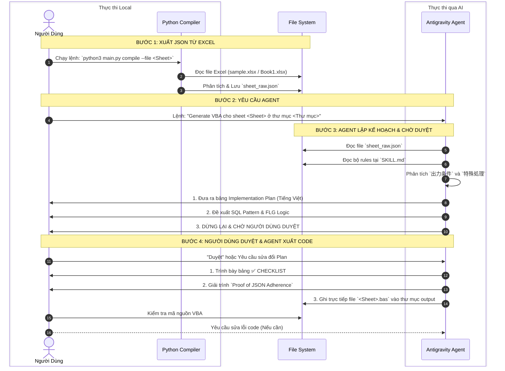

# Hướng dẫn sử dụng Agent để Generate Mã VBA

Tài liệu này mô tả chi tiết quy trình phối hợp giữa Người Dùng (Bạn) và Agent (Antigravity/AI) để sinh ra mã nguồn VBA chuẩn xác, đảm bảo bám sát 100% logic nghiệp vụ được mô tả trong file JSON đặc tả.

---

## 1. Sơ đồ Luồng Hoạt Động (Flowchart)

Dưới đây là sơ đồ chi tiết về các bước tương tác và luồng xử lý dữ liệu giữa các thành phần trong hệ thống:



---

## 2. Hướng dẫn chi tiết từng bước (Step-by-Step)

### Bước 1: Parse dữ liệu từ Excel ra JSON (Thực thi Local)
Để AI có thể hiểu được yêu cầu nghiệp vụ, bạn cần dùng script Python để trích xuất dữ liệu từ Excel thành file cấu trúc JSON.

**Lệnh thực thi:**
```bash
# Ví dụ xuất data cho sheet 契約_解約_C ở thư mục test5
python3 main.py compile --test5 --file 契約_解約_C
```
*Kết quả:* Hệ thống sẽ tạo ra file `/output/test5/.../契約_解約_C/sheet_raw.json` chứa toàn bộ đặc tả logic của sheet.

### Bước 2: Ra lệnh cho Agent (Trên khung Chat)
Bạn chỉ cần cung cấp thông tin ngắn gọn để Agent tự động định vị file JSON và làm việc.

**Mẫu câu lệnh:**
> *"Hãy generate code VBA cho sheet `[Tên Sheet]` ở thư mục `[Tên thư mục test]`"*

**Ví dụ:**
> *"Tiến hành generate sheet `契約_解約_C` trong thư mục `test5` cho tôi."*

### Bước 3: Agent lập Plan & Chờ Duyệt (BẮT BUỘC)
Khi nhận được lệnh, Agent sẽ KHÔNG nhả code ngay lập tức. Agent phải tuân thủ luồng:
1. **Thu thập Context**: Tự động gọi tool `view_file` đọc `sheet_raw.json` và `SKILL.md`.
2. **Lập Kế Hoạch (Implementation Plan)**: Agent trình bày một bảng phân tích bằng tiếng Việt bao gồm:
   - Các bảng phụ cần JOIN và thứ tự tầng FLG (1, 2, 3).
   - Thiết kế các khối UPDATE gộp (gom field theo WHERE).
   - Pattern sẽ áp dụng (SWITCH, Hyphen-to-NULL).
3. **Chờ Duyệt**: Agent dừng quá trình lại và hỏi xin ý kiến người dùng. Bạn cần duyệt ("OK", "Duyệt") thì Agent mới được viết code.

### Bước 4: Agent báo cáo và Xuất Code
Sau khi bạn Duyệt Plan:
1. **Audit & Báo cáo (BẮT BUỘC)**: Agent tiến hành tự chấm điểm bản thân dựa trên 8 tiêu chí cốt lõi (Checklist) và phải viết giải trình chứng minh code đã viết khớp 100% với JSON.
2. **Xuất File**: Agent dùng tool `write_to_file` để tạo trực tiếp file `.bas` vào đúng thư mục dự án của bạn.

### Bước 5: Nghiệm thu Code (User)
1. Bạn kiểm tra file `.bas` đã được lưu thành công trên VS Code.
2. Feedback lại cho Agent nếu có bất kỳ logic nào bị sai lệch hoặc cần tối ưu.
